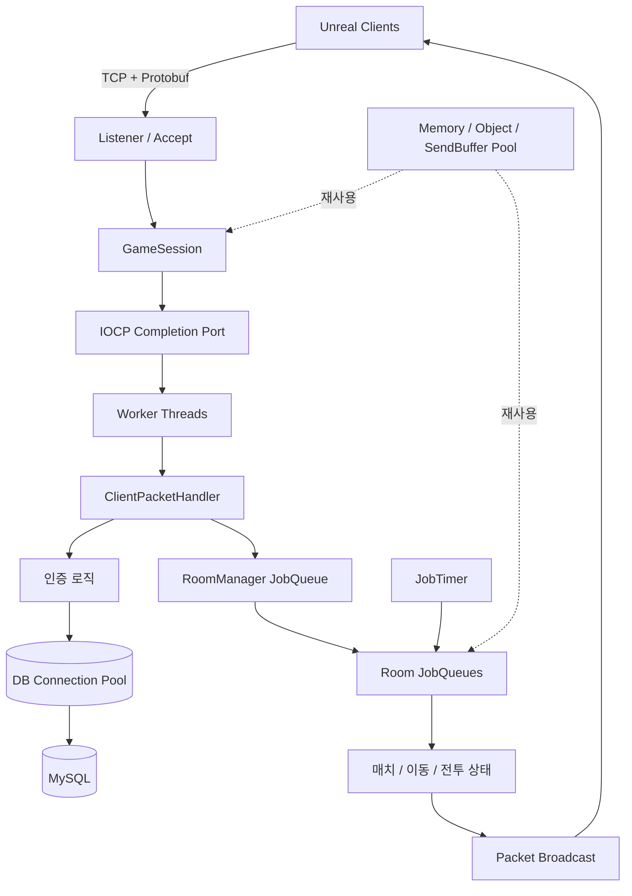
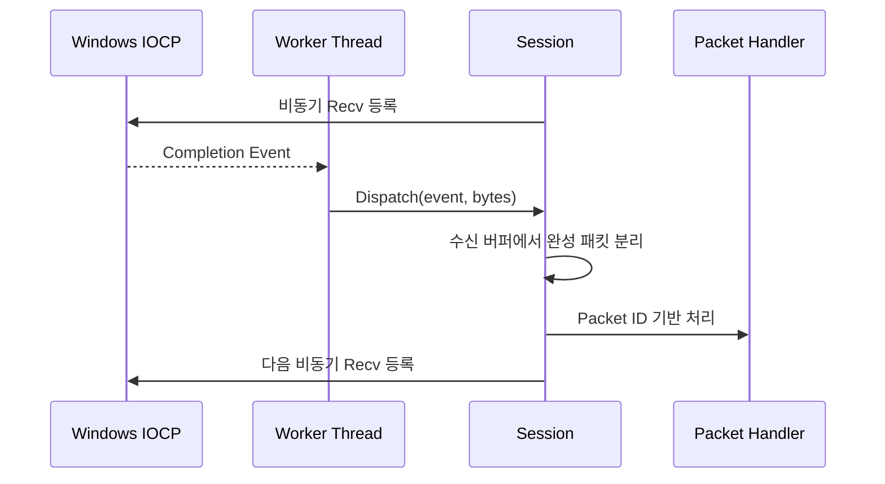
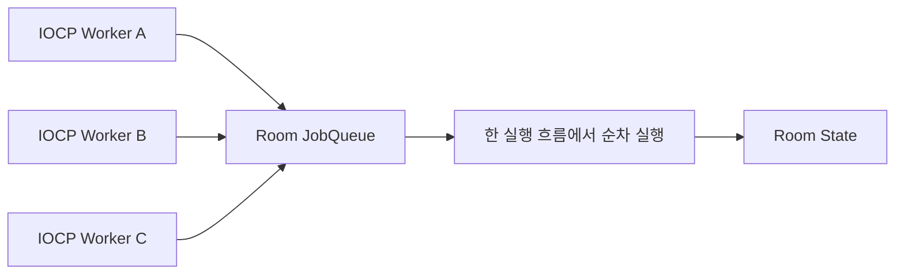
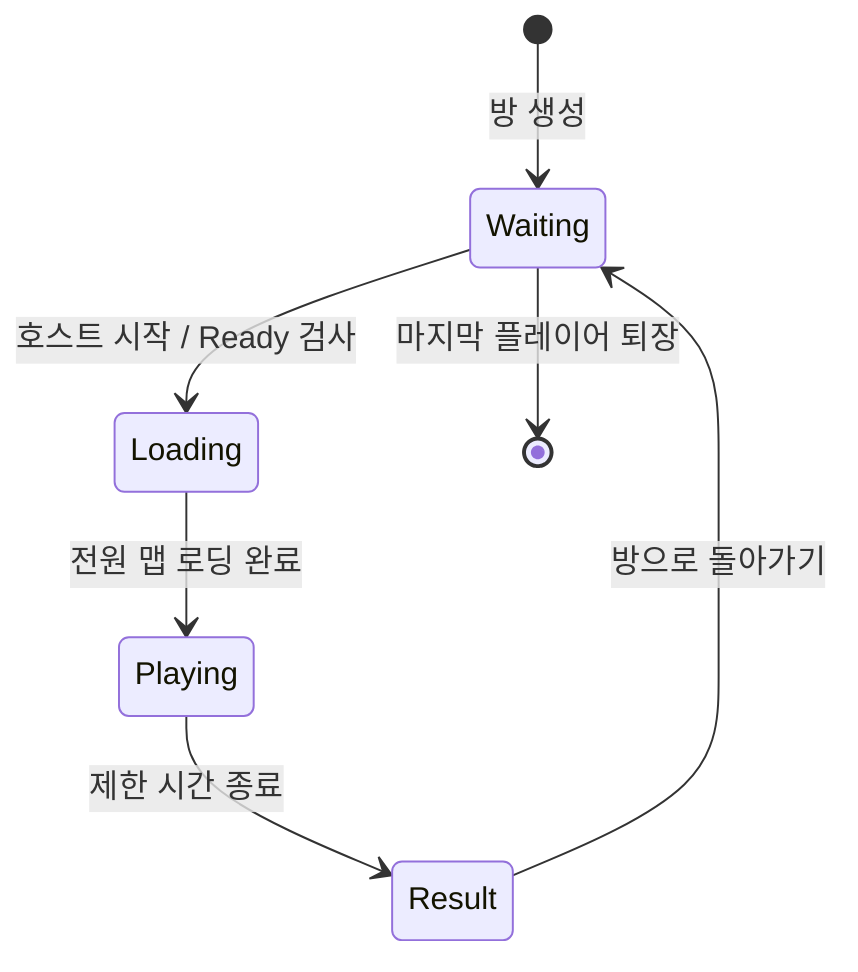
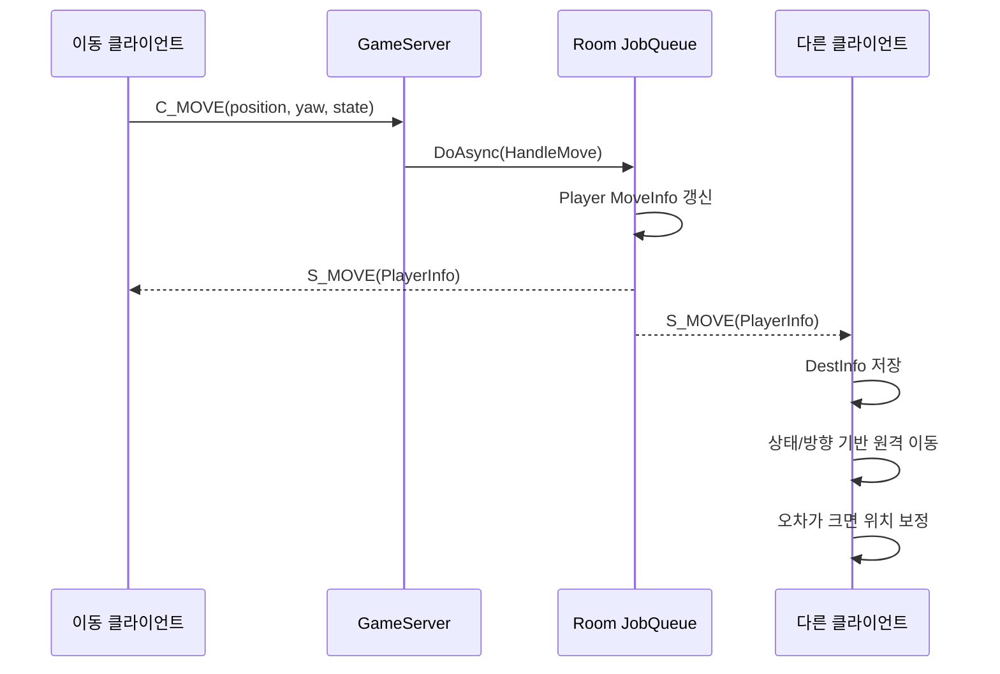
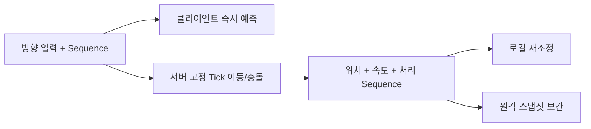
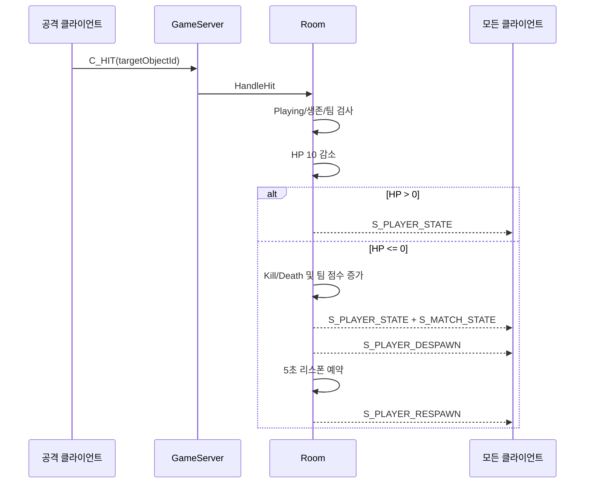
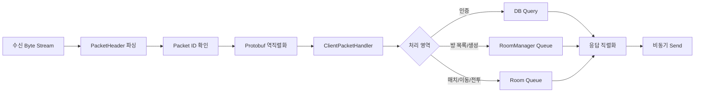

# PvP Game Server

Windows IOCP 기반 비동기 네트워크 코어 위에 로그인, 로비, 방, 팀 매치, 이동 및 슈팅 로직을 구현한 C++ 온라인 게임 서버입니다. Unreal Engine 클라이언트와 TCP 및 Google Protocol Buffers로 통신합니다.

## 프로젝트 개요

| 항목 | 내용 |
| --- | --- |
| 서버 | Windows IOCP 비동기 서버 |
| 언어 | GameServer C++20 / ServerCore C++17 |
| 동시성 | IOCP Worker Thread + JobQueue |
| 직렬화 | Google Protocol Buffers |
| 데이터베이스 | MySQL, ODBC, Connection Pool |
| 인증 | libsodium 비밀번호 해시 |
| 기본 엔드포인트 | `127.0.0.1:7777` |
| 기본 세션 상한 | 100 |

## 주요 구현 내용

- IOCP 기반 Accept/Recv/Send 비동기 처리
- 패킷 헤더와 Protobuf 메시지를 이용한 패킷 디스패치
- 메모리 풀, 객체 풀, 전송 버퍼 청크 재사용
- 작업 큐를 이용한 Room/RoomManager 로직 직렬화
- 예약 작업 기반 0.1초 매치 Tick과 리스폰 타이머
- ODBC 연결 풀과 DB 바인딩 래퍼
- libsodium을 이용한 비밀번호 해시 생성 및 검증
- 로비, 방, 팀, Ready, 매치 상태 머신
- 이동 상태 중계, 발사 속도 제한, 피해·점수·리스폰 처리

## 서버 전체 구조



네트워크 완료 이벤트는 여러 Worker Thread가 처리하지만, 게임 상태 변경은 `RoomManager` 또는 각 `Room`의 JobQueue로 전달합니다. 같은 방의 작업은 한 번에 하나의 실행 흐름에서 순서대로 처리되므로 게임 로직의 순서를 이해하기 쉽습니다. 서로 다른 방은 별도의 큐이므로 병렬 실행될 수 있습니다.

## ServerCore

ServerCore는 게임 규칙과 분리된 네트워크·동시성 기반 계층입니다. 포트폴리오에서는 다음 네 가지 요소를 핵심으로 볼 수 있습니다.

### IOCP

`IocpCore`는 `CreateIoCompletionPort`로 Completion Port를 만들고 소켓 객체를 등록합니다. Worker Thread는 `GetQueuedCompletionStatus`를 호출해 Accept, Recv, Send 완료 이벤트를 가져오고, 이벤트의 소유 객체에 처리를 위임합니다.



현재 GameServer는 5개의 Worker Thread를 실행합니다. 각 Worker는 네트워크 이벤트 처리, 예약 작업 분배, GlobalQueue 작업 실행을 반복합니다.

### 메모리 및 객체 풀링

빈번한 동적 할당 비용과 메모리 파편화를 줄이기 위해 크기별 `MemoryPool`을 사용합니다.

- Windows lock-free `SLIST`로 반환된 메모리 블록 관리
- `MemoryHeader`에 실제 할당 크기 기록
- `ObjectPool<T>`가 placement new와 명시적 소멸자로 객체 수명 관리
- `shared_ptr` custom deleter로 참조 카운팅과 풀 반환 결합
- `SendBufferChunk`에서 작은 전송 버퍼를 연속 할당하여 재사용

Job과 네트워크 이벤트처럼 생성 빈도가 높은 객체가 대표적인 풀링 대상입니다.

### JobQueue

패킷을 받은 IOCP Worker가 Room 상태를 직접 수정하지 않고 `DoAsync`로 작업을 큐에 넣습니다.



첫 작업을 넣은 스레드가 큐 실행권을 얻거나 GlobalQueue에 실행을 위임합니다. 실행 시간 한도에 도달하면 남은 작업을 GlobalQueue로 되돌려 특정 방이 Worker를 장시간 독점하지 않게 합니다. 이 구조로 같은 Room의 입장, 팀 변경, 이동, 피격, 퇴장 순서를 보존합니다.

### JobTimer

`JobTimer`는 실행 시각을 기준으로 하는 Priority Queue에 예약 작업을 보관합니다. 만료된 작업은 원래 소유한 JobQueue로 전달되므로 타이머 콜백도 해당 방의 다른 작업과 같은 직렬 실행 규칙을 따릅니다.

현재 사용 예시는 다음과 같습니다.

- 100ms 간격 `Room::UpdateTick`
- 사망 후 5초 리스폰
- 매치 남은 시간과 발사 쿨다운 갱신

## 데이터베이스

서버는 MySQL에 ODBC로 연결하며, 시작 시 4개의 연결을 생성해 `DBConnectionPool`에서 관리합니다. 요청 처리 코드는 연결을 `Pop`하고 사용 후 `Push`하여 반환합니다.

현재 영속 데이터의 중심은 계정입니다.

| 컬럼 | 용도 |
| --- | --- |
| `account_id` | 계정 식별자 |
| `login_id` | 로그인 ID, 중복 검사 대상 |
| `password_hash` | libsodium으로 생성한 비밀번호 해시 |
| `nickname` | 게임 표시 이름, 중복 검사 대상 |

### 회원가입

1. ID 길이와 영문/숫자 형식을 검증합니다.
2. 비밀번호와 닉네임 길이, 닉네임 제어 문자를 검증합니다.
3. libsodium `crypto_pwhash_str`로 비밀번호 해시를 만듭니다.
4. Prepared Parameter Binding으로 ID와 닉네임 중복을 조회합니다.
5. 중복이 없으면 계정 행을 추가합니다.

### 로그인

1. `login_id`로 계정 ID, 비밀번호 해시, 닉네임을 조회합니다.
2. `crypto_pwhash_str_verify`로 평문 비밀번호를 검증합니다.
3. 인증에 성공하면 Session에 계정 ID와 닉네임을 연결합니다.
4. 게임 Object ID를 발급하고 클라이언트에 로그인 결과를 전송합니다.

`DBBind<InputCount, OutputCount>`는 입력 Parameter와 조회 Column의 수를 타입에 포함하고, ODBC Bind/Execute/Fetch 호출을 공통화합니다. 문자열을 연결해 쿼리를 만드는 대신 Parameter Binding을 사용해 입력값과 SQL을 분리합니다.

> 실행 전 `GameServer.cpp`의 로컬 DB 연결 정보를 자신의 환경에 맞게 설정해야 합니다. 실제 배포 환경에서는 접속 문자열과 비밀 값을 소스에 두지 않고 환경 변수 또는 별도 Secret 설정으로 분리해야 합니다.

## 로비와 매치 상태



- `RoomManager`: 방 ID 발급, 방 목록, 생성, 입장 관리
- `Room`: 플레이어, 팀, Ready, 매치 상태와 브로드캐스트 관리
- `Player`: Session, Room, 팀, 이동 정보, HP 및 Kill/Death 보관
- 호스트만 매치를 시작할 수 있고 다른 플레이어의 Ready 여부를 검사합니다.
- 전원이 `C_MATCH_PREPARE`를 보내면 Playing 상태로 전환합니다.
- 매치는 60초 동안 진행되며 상태를 주기적으로 브로드캐스트합니다.
- 사망자는 5초 후 팀 시작 위치에서 HP가 회복된 상태로 리스폰합니다.

## 이동 동기화

### 현재 구현

클라이언트는 위치 `(x, y, z)`, 이동 방향을 표현하는 `yaw`, `IDLE/MOVE` 상태를 `C_MOVE`로 보냅니다. 입력이 변할 때 즉시 보내고, 입력 상태와 관계없이 0.05초 주기로 최신 위치를 갱신합니다.



Room JobQueue를 거치므로 같은 방에서 이동, 사격, 피격 이벤트의 처리 순서가 보존됩니다. 서버가 보관한 최신 `MoveInfo`는 초기 스폰과 리스폰에도 사용됩니다.

### 현재 방식의 트레이드오프

현재 서버는 클라이언트 위치를 검증하거나 직접 시뮬레이션하지 않고 최신 위치를 중계합니다. 구현이 단순하고 로컬 반응성이 좋지만 다음 오차가 발생할 수 있습니다.

- 빠른 WASD 방향 전환 시 패킷 사이의 경로가 각 클라이언트에서 다르게 재현됨
- FPS, 패킷 도착 시점, 로컬 충돌 결과에 따른 원격 위치 차이
- 임계값 이하의 위치 오차가 누적되거나 정지 후 남을 수 있음
- 비정상적인 이동 속도나 순간이동을 서버에서 확정적으로 차단하기 어려움

### 서버 권위 동기화로의 개선 방향

경쟁형 PvP에 적합한 다음 단계는 좌표가 아니라 입력을 서버에 보내는 구조입니다.



가속이 없는 쿼터뷰 이동 모델을 사용하면 `정규화된 입력 방향 × 고정 최고속도`로 클라이언트와 서버의 계산을 단순화할 수 있습니다. 이후 입력 Sequence, 서버 Tick, 속도를 패킷에 추가하고 서버가 충돌 및 최종 위치를 결정하도록 확장할 예정입니다.

## 슈팅 및 전투 동기화

### 발사

클라이언트가 캐릭터 위치와 정규화된 발사 방향을 `C_FIRE`로 보냅니다. 서버는 다음 조건을 확인합니다.

- Session의 플레이어와 패킷의 Object ID가 일치하는가
- 플레이어가 현재 Room에 존재하는가
- 0.1초 Tick으로 관리되는 발사 쿨다운이 준비되었는가

검사를 통과하면 쿨다운을 소비하고 `S_FIRE`를 방 전체에 브로드캐스트합니다. 각 클라이언트는 동일한 위치와 방향으로 투사체를 생성해 화면에 재현합니다.

### 피격, 점수, 리스폰



서버가 HP, 생존 여부, Kill/Death, 팀 점수를 단일 상태로 관리하기 때문에 피해 적용 이후의 결과는 모든 클라이언트에 동일하게 전파됩니다.

### 현재 판정 방식의 한계와 개선 방향

현재 `C_HIT`에는 대상 ID만 포함되며 서버는 투사체 궤적 자체를 시뮬레이션하지 않습니다. 따라서 클라이언트 간 원격 위치가 다르면 한 화면에서는 맞고 다른 화면에서는 빗나가는 현상이 발생할 수 있고, 피격 요청 위변조 검증도 제한적입니다.

이를 해결하기 위한 목표 구조는 다음과 같습니다.

1. 서버가 고유 Projectile ID와 생성 시각을 발급합니다.
2. 서버 고정 Tick에서 투사체를 이동시키고 구간 Sweep으로 충돌을 검사합니다.
3. 클라이언트 투사체는 입력 반응성과 화면 표현을 위한 예측 객체로만 사용합니다.
4. 서버가 `S_PROJECTILE_HIT`와 최종 피해 결과를 브로드캐스트합니다.
5. 필요하면 최근 플레이어 위치 이력을 보관해 RTT 기반 Lag Compensation을 적용합니다.

핵심은 모든 클라이언트의 렌더링 위치를 완전히 같게 만드는 것이 아니라, 이동과 피격의 최종 결과를 서버의 하나의 시간축에서 결정하는 것입니다.

## 패킷 처리 흐름



## 디렉터리 구조

```text
Server_std/
├─ ServerCore/             # IOCP, Session, Buffer, Pool, JobQueue, DB 공통 계층
├─ GameServer/             # 인증, Room, Player, 패킷 핸들러와 게임 규칙
├─ DummyClient/            # 다중 접속 및 패킷 테스트용 클라이언트
├─ Common/
│  ├─ Protobuf/bin/        # Protocol.proto, Struct.proto, Enum.proto
│  └─ Procedures/          # DB 프로시저 코드 생성 템플릿
├─ Libraries/              # ServerCore 및 외부 라이브러리
├─ Tools/                  # 프로토콜/DB 관련 도구
└─ Server.sln
```

## 빌드 및 실행

### 요구 환경

- Windows 10/11
- Visual Studio 2022, MSVC v143
- Windows SDK 10
- MySQL 및 호환 ODBC Driver
- Google Protocol Buffers
- libsodium

### 실행 순서

1. MySQL에 `pvp_game` 데이터베이스와 `accounts` 테이블을 준비합니다.
2. `GameServer.cpp`의 DB 접속 정보를 로컬 환경에 맞게 설정합니다.
3. `Server.sln`을 열고 `GameServer`를 x64로 빌드합니다.
4. GameServer를 실행하여 DB 연결 성공과 `127.0.0.1:7777` Listen 상태를 확인합니다.
5. Unreal 클라이언트를 두 개 이상 실행해 회원가입, 로그인, 방 입장 및 매치를 테스트합니다.

## 향후 개선

- DB 접속 정보의 환경 변수/Secret 분리
- 로그인·DB 작업의 별도 비동기 작업 큐 분리
- 서버 권위 이동과 속도·맵 충돌 검증
- 스냅샷 보간, 클라이언트 예측 및 reconciliation
- 서버 권위 Projectile과 swept collision
- 발사 시각 검증과 lag compensation
- 패킷 rate limit, 잘못된 상태 전이 및 재전송 방어
- 지연·패킷 분할·대량 접속을 포함한 부하 테스트 자동화
