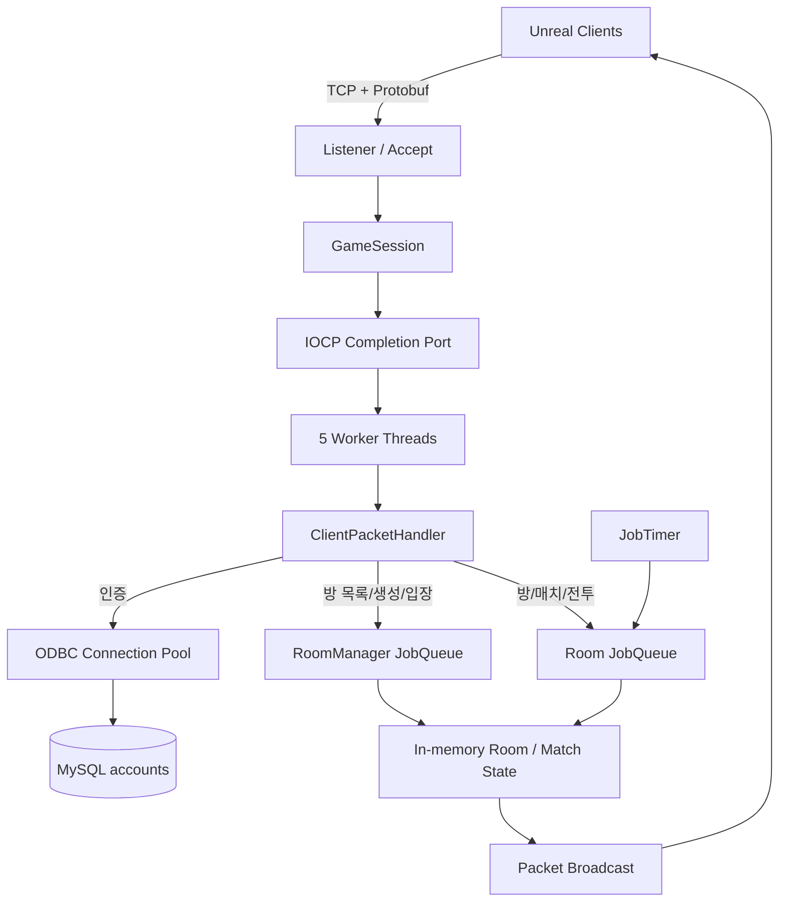
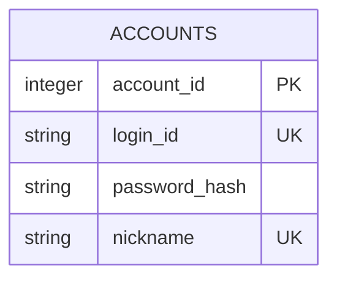

# PvP Game Server

Windows IOCP 기반 비동기 네트워크 코어 위에 인증, 로비, 방, 팀 매치, 이동과 슈팅 로직을 구현한 C++ 온라인 게임 서버입니다. Unreal Engine 클라이언트와 TCP 및 Google Protocol Buffers로 통신합니다.

> 이 저장소는 서버 프로젝트입니다. 클라이언트 저장소는 [Unreal_Project_Arena](https://github.com/JJW8584/Unreal_Project_Arena)입니다.

## 프로젝트 개요

다수의 클라이언트 연결을 적은 수의 Worker Thread로 처리하면서, 같은 방에서 발생하는 입장·팀 변경·이동·전투 이벤트의 순서를 보장하는 것이 목표입니다.

IOCP가 네트워크 I/O를 비동기로 처리하고, `RoomManager`와 각 `Room`의 `JobQueue`가 공유 게임 상태 변경을 직렬화합니다. MySQL에는 계정만 영속화하며 방과 매치 상태는 서버 메모리에서 관리합니다.

| 항목 | 현재 구성 |
| --- | --- |
| 기본 엔드포인트 | `127.0.0.1:7777` |
| 최대 세션 수 | 100 |
| Worker Thread | 5 |
| DB Connection Pool | 4 connections |
| 매치 시간 | 60초 |
| 게임 Tick | 100ms |
| 리스폰 | 사망 후 5초 |
| 발사 쿨다운 | 1초 |

## 기술 스택

| 구분 | 기술 |
| --- | --- |
| 언어 | GameServer C++20, ServerCore C++17 |
| 플랫폼 | Windows 10/11, Windows SDK 10 |
| 빌드 | Visual Studio 2022, MSVC v143, x64 |
| 비동기 네트워크 | Windows IOCP, Overlapped I/O, TCP Socket |
| 직렬화 | Google Protocol Buffers |
| 데이터베이스 | MySQL, ODBC, 자체 `DBConnectionPool` / `DBBind` |
| 비밀번호 | libsodium `crypto_pwhash_str` |
| 동시성 | Worker Thread, `JobQueue`, `JobTimer`, Reader/Writer Lock |
| 메모리 | `MemoryPool`, `ObjectPool`, `SendBufferChunk` |
| 캐시 | 별도 캐시 미사용. 방·매치 상태는 프로세스 메모리에 유지 |

## 주요 기능

- 회원가입, 로그인, 비밀번호 해시 검증
- 로그인 ID·닉네임 중복 검사와 동일 계정 중복 접속 차단
- 방 목록, 방 생성·입장·퇴장, 호스트 위임
- 캐릭터 타입과 Red/Blue 팀 선택, Ready 동기화
- 호스트 시작 권한과 전원 로딩 완료 검사
- 60초 팀 매치, HP, Kill/Death, 팀 점수 관리
- 이동 상태 중계와 초기 스폰·리스폰 위치 관리
- 1초 발사 제한, 피격, 사망, 5초 리스폰
- 채팅 패킷 브로드캐스트
- 메모리·객체·전송 버퍼 풀링

## 아키텍처



여러 Worker가 IOCP 완료 이벤트를 병렬 처리하지만 게임 상태를 직접 동시에 수정하지 않습니다. 방 관련 작업은 해당 `JobQueue`에 넣어 순서대로 실행하고, 서로 다른 방은 독립적인 큐에서 병렬로 진행할 수 있습니다. `JobTimer`의 100ms Tick과 리스폰 예약도 원래 방의 큐로 돌아와 같은 순서 보장 규칙을 따릅니다.

## 패킷 API 명세

API 엔드포인트는 TCP `127.0.0.1:7777`이며, Method 역할은 16비트 패킷 ID가 담당합니다.

모든 프레임은 다음 형식입니다.

```text
[uint16 size][uint16 packet_id][Protocol Buffers payload]
```

### 요청·응답

| 기능 | 요청(ID) | 주요 요청값 | 응답·이벤트(ID) | 주요 응답값 |
| --- | --- | --- | --- | --- |
| 로그인 | `C_LOGIN` (1000) | `login_id`, `password` | `S_LOGIN` (1001) | `success`, `result`, `account_id`, `object_id`, `nickname` |
| 회원가입 | `C_REGISTER` (1002) | `login_id`, `password`, `nickname` | `S_REGISTER` (1003) | `success`, `result` |
| 방 목록 | `C_ROOM_LIST` (1004) | 없음 | `S_ROOM_LIST` (1005) | `rooms[]` |
| 방 생성 | `C_CREATE_ROOM` (1006) | `room_name`, `max_player_count` | `S_CREATE_ROOM` (1007) | `success`, `room_info` |
| 방 입장 | `C_ENTER_ROOM` (1008) | `room_id` | `S_ENTER_ROOM` (1009) | `success`, `room_info` |
| 방 퇴장 | `C_LEAVE_ROOM` (1010) | 없음 | `S_LEAVE_ROOM` (1011) | `success` |
| 팀 변경 | `C_CHANGE_TEAM` (1013) | `team` | `S_ROOM_STATE` (1015) | 갱신된 `room_info` |
| Ready | `C_READY` (1014) | `ready` | `S_ROOM_STATE` (1015) | 갱신된 `room_info` |
| 매치 시작 | `C_START_MATCH` (1016) | 없음 | `S_MATCH_PREPARE` (1017) | `match_info` |
| 로딩 완료 | `C_MATCH_PREPARE` (1018) | 없음 | `S_MATCH_START` (1019) | `match_id` |
| 이동 | `C_MOVE` (1023) | `x`, `y`, `z`, `yaw`, `state` | `S_MOVE` (1024) | `player_info` |
| 발사 | `C_FIRE` (1025) | `object_id`, 생성 위치, 방향 | `S_FIRE` (1026) | 발사자 ID, 생성 위치, 방향 |
| 피격 | `C_HIT` (1027) | `target_object_id` | `S_PLAYER_STATE` (1021) 등 | HP, 생존, Kill/Death |
| 방 복귀 | `C_RETURN_TO_ROOM` (1030) | 없음 | `S_RETURN_TO_ROOM` (1031) | `room_info` |
| 채팅 | `C_CHAT` (1032) | `msg` | `S_CHAT` (1033) | `player_id`, `msg` |

매치 중 서버가 보내는 Push 이벤트에는 `S_MATCH_STATE`(1020), `S_PLAYER_RESPAWN`(1022), `S_PLAYER_DESPAWN`(1028), `S_MATCH_END`(1029)가 있습니다. 전체 필드는 `Common/Protobuf/bin/Protocol.proto`, `Struct.proto`, `Enum.proto`를 기준으로 합니다.

### 인증 결과

`S_LOGIN`과 `S_REGISTER`의 `result`는 성공, 잘못된 입력, 로그인 ID 중복, 닉네임 중복, 잘못된 자격 증명, 서버 오류를 구분합니다. 로그인 성공 직전 `GameSessionManager::TryLogin`이 Session 목록을 쓰기 잠금으로 검사하고 계정 ID를 등록하므로, 같은 계정의 동시 로그인은 `AUTH_RESULT_DUPLICATE_LOGIN_ID`로 거부됩니다.

## DB 설계

현재 영속 데이터는 MySQL의 `accounts` 단일 테이블입니다. 방, 플레이어 전투 상태, 점수는 메모리 데이터이며 DB 관계는 없습니다.

| 컬럼 | 역할 | 제약·사용 방식 |
| --- | --- | --- |
| `account_id` | 계정 PK | 로그인 성공 시 Session에 연결되는 정수 식별자 |
| `login_id` | 로그인 ID | 4~64자의 영문·숫자, 중복 검사 |
| `password_hash` | 비밀번호 해시 | libsodium 해시 문자열 저장, 평문 미저장 |
| `nickname` | 표시 이름 | 2~16자 입력 검증, 중복 검사 |



저장소에는 `accounts` 생성 DDL과 마이그레이션이 아직 포함되어 있지 않습니다. 실제 컬럼 타입과 UNIQUE 제약은 로컬 DB 스키마에 맞춰 준비해야 하며, 재현 가능한 스키마 파일 추가는 개선 계획에 포함합니다.

## 실행 방법

### 사전 요구 사항

- Windows 10/11, Visual Studio 2022, MSVC v143, Windows SDK 10
- MySQL Server 및 코드의 연결 문자열과 일치하는 MySQL ODBC Unicode Driver
- Google Protocol Buffers와 libsodium 라이브러리
- `pvp_game` 데이터베이스와 위 `accounts` 테이블

### 로컬 실행

1. MySQL에 데이터베이스, 서버용 사용자, `accounts` 테이블을 준비합니다.
2. `GameServer/GameServer.cpp`의 ODBC Driver, Host, Port, Database, User, Password를 로컬 환경에 맞게 설정합니다.
3. `Server.sln`을 열고 `GameServer`를 x64로 빌드합니다.
4. `GameServer`를 실행하고 DB 연결 성공 여부를 확인합니다.
5. 서버가 `127.0.0.1:7777`에서 Listen하면 Unreal 클라이언트를 실행합니다.

현재 환경 변수 로딩은 구현되어 있지 않고 DB 접속 정보가 소스에 들어갑니다. 운영용 자격 증명을 커밋하지 말고, 배포 전 환경 변수나 별도 Secret 설정으로 분리해야 합니다.

## 테스트 방법

현재 자동 테스트와 부하 테스트 스크립트는 포함되어 있지 않습니다. 아래는 구현을 검증할 수 있는 수동 테스트 절차입니다.

### 기능·패킷 테스트

1. 두 개 이상의 서로 다른 계정으로 접속합니다.
2. 회원가입 중복 ID·닉네임과 잘못된 로그인 정보를 보내 `AuthResult`를 확인합니다.
3. 같은 계정으로 동시에 로그인해 두 번째 Session이 거부되는지 확인합니다.
4. 방 생성·입장·퇴장, 팀 변경, Ready, 비호스트의 시작 요청을 순서대로 검증합니다.
5. 모든 클라이언트의 로딩 완료 후에만 매치가 시작되는지 확인합니다.
6. 이동, 1초 발사 제한, 아군 피격 방지, 사망, 5초 리스폰, 60초 종료 결과를 비교합니다.

### 동시 접속·부하 테스트

`DummyClient`는 최대 100개의 TCP 세션을 열 수 있는 기반 프로젝트지만 현재는 빈 로그인 패킷과 채팅 패킷만 보내므로 완전한 시나리오 부하 도구는 아닙니다. 유효한 테스트 계정과 단계별 패킷 시나리오를 추가한 뒤 다음 항목을 측정합니다.

- 1~100개 동시 연결의 접속 성공률과 처리 지연
- 동일 계정 동시 로그인 경쟁 시 단일 Session만 성공하는지 여부
- 여러 방에서 이동 패킷을 30Hz로 보낼 때 Worker 처리량과 큐 적체
- 패킷 분할·병합, 비정상 패킷 ID, 갑작스러운 연결 종료 시 안정성

## 문제 해결

### 여러 Worker의 Room 상태 경쟁

- 문제: IOCP Worker가 같은 Room을 동시에 수정하면 입장, Ready, 피격 순서가 뒤섞일 수 있었습니다.
- 해결: 패킷 핸들러는 게임 로직을 `RoomManager` 또는 `Room`의 `JobQueue`에 넘기고, 같은 큐의 작업을 한 실행 흐름에서 순차 처리하도록 구성했습니다.

### 빈번한 네트워크 객체 할당

- 문제: 패킷, Job, Send Buffer의 반복 할당은 처리량 저하와 메모리 파편화를 만들 수 있습니다.
- 해결: 크기별 `MemoryPool`, placement new 기반 `ObjectPool`, 연속 영역을 재사용하는 `SendBufferChunk`를 적용했습니다.

### 비밀번호 보관과 SQL 입력 처리

- 문제: 평문 비밀번호 저장과 문자열 결합 쿼리는 보안 위험이 큽니다.
- 해결: libsodium으로 비밀번호를 해시·검증하고, `DBBind`의 ODBC Parameter Binding으로 사용자 입력과 SQL을 분리했습니다.

### 중복 로그인 경쟁 조건

- 문제: 인증된 계정 ID를 Session에 단순 저장하면 같은 계정의 동시 요청이 모두 성공할 수 있습니다.
- 해결: `GameSessionManager::TryLogin`이 Session 집합의 쓰기 잠금 안에서 중복 검사와 계정 등록을 하나의 임계 구역으로 수행하도록 변경했습니다.

### 발사 쿨다운이 즉시 풀리는 문제

- 문제: 발사 시 `fireFlag`만 끄고 남은 Tick을 재설정하지 않으면 이전 Timer 값에 따라 다음 Tick에서 바로 발사 가능 상태가 될 수 있었습니다.
- 해결: 발사 성공 시 `fireTimer = 10`으로 재설정하고 100ms Tick에서 감소시켜 항상 1초 제한을 적용했습니다.

## 개선 계획

- DB 접속 정보를 환경 변수 또는 Secret으로 분리
- `accounts` DDL과 버전별 DB 마이그레이션 추가
- 로그인·DB 작업을 별도 비동기 작업 큐로 분리
- 서버 권위 이동, 속도·맵 충돌 검증, 입력 Sequence 추가
- 클라이언트 예측·재조정과 원격 스냅샷 보간
- 서버 권위 Projectile, swept collision, lag compensation
- 인증 및 게임 패킷 rate limit과 잘못된 상태 전이 방어
- 단위·통합 테스트와 100개 이상 동시 접속 부하 테스트 자동화
